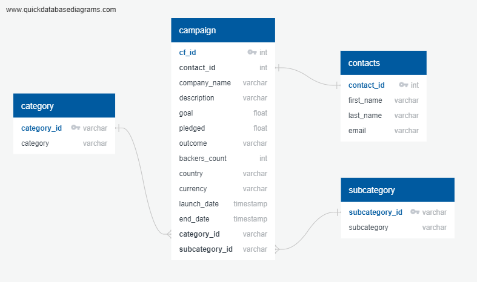

## Crowdfunding ETL, 11 September 2023

Development on this project has stopped.

## Description

This project simulates building an Extract-Transform-Load (ETL) pipeline. Extracting data from two excel files, `Resources/crowdfunding.xlsx` and `Resources/contacts.xlsx`, a jupyter notebook cleans up the data and exports it to new .csv files. The new .csv files are used to create a PostgreSQL relational database management system (RDBMS).

Data modeling is accomplished using [QuickDBD](https://app.quickdatabasediagrams.com/#/) to create an entity relationship diagram (ERD).

`crowdfunding_db_schema.sql` contains the code to create all of the tables for the RDBMS.

## Usage

You can view the data extraction and cleanup process in `ETL_Mini_Project_AAmparo_BJohns.ipynb`. If you want to run the code, simply restart the kernel and 'run all'.

Tables can be recreated using `crowdfunding_db_schema.sql` and directly importing the data using the pgAdmin GUI. Confirm the data has been imported by running the queries in `confirm_tables.sql`.

The ERD can be found at [this Quick DBD link](https://app.quickdatabasediagrams.com/#/d/YmTQEe). Code to create the ERD is located in `ERD_schema.txt`. `Resources/ERD_schema_docs.pdf` contains more info on the ERD.

## Gallery

Entity Relationship Diagram (ERD) for project:

## Acknowledgments

Thanks to Geronimo Perez for feedback and assistance

## Authors

Amber Amparo and Bryan Johns, September, 2023
